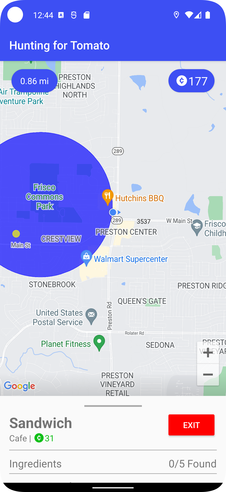
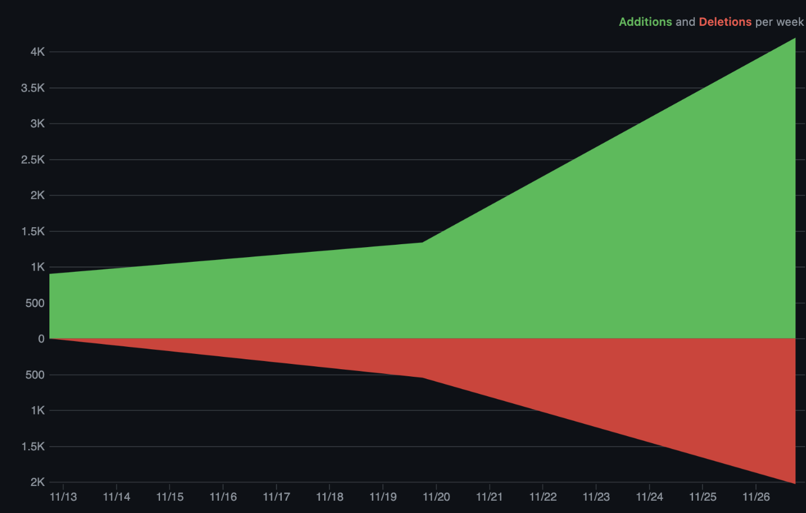

# FoodHunt

## Group Members

| Srujan Mupparapu | sm76696 | smupparapu@utexas.edu |
| --- | --- | --- |
| Yatin Pokle | yvp79 | yatinpokle@utexas.edu |

## Design Concept

FoodHunt is an interactive geolocation “foodie” game where players become freelance chefs in a quest to create and sell the most food items. Player’s follow dynamically generated recipes based on their current location to search for ingredients in the digital world, using an elegant in-game map to find their way around the real world.

## Inspiration

The main inspiration for this app is the game Pokemon GO. It also is an immersive game centered our geolocation and real-time interactions with the surrounding environment. Some people love Pokemon, but everyone loves food.

The main design inspiration for this map is the Google Maps app itself. The Google Maps app utilizes an innovative UI design to display the map and other content at the same time and on the same screen, creating a seamless user experience.

## APIs and Android Features

- **Place Search (Google Maps API)**: query for nearby places (restaurants, stores, etc.) within a radius, ranked by distance.
- **Place Details (Google Maps API)**: query for the details about a place, such as address, name, photos, reviews, price level, etc.
- **Directions (Google Maps API**): get a drawable route from one point to another on the map.
- **Interactive Google Map**: display user location on a map and location-based hints for recipe hunting.
- **Location Services**: stream the real-time location of the user for use in map updates and API calls to Google Maps services.
- **Sliding Panel**: display UI on a panel over the map.

## Screenshot

## Third Party Libraries

- **Glide**: We used the Glide service to display network images for place photos and profile pictures of user reviews. From the API call, we received image URLs and used Glide to read those network images into the image views. A challenge we faced was supplying Glide with the correct image URL, as the URLs received by the Place Details API call was only a piece, resulting in red boxes showing instead of images.
- **Moshi**: We used the Moshi service to parse JSON response bodies from the Google Maps API calls into Kotlin objects using simple annotations. A challenge we faced was parsing nested JSON objects in the response body into the correct Kotlin objects.
- **Retrofit**: We used Retrofit to make Google Maps API calls. We defined a GoogleMapsService interface to simplify making the API calls. A challenge we faced was debugging the HTTP requests and inspecting the response bodies, which we solved by using http logging in the retrofit builder.

## Third Party Services

- **Place Search (Google Maps API)**: query for nearby places (restaurants, stores, etc.) within a radius, ranked by distance.
- **Place Details (Google Maps API)**: query for the details about a place, such as address, name, photos, reviews, price level, etc.
- **Directions (Google Maps API**): get a drawable route from one point to another on the map.

## **UI Design**

Because the game and app revolve so much around the map, we did not want to take that away from the user and wanted it to be visible at all times. As a result, we implemented a sliding panel that is accessible to the user at all times so that the user can slide up without switching activities to show relevant information. The implementation of the sliding panel that we used can be found here ([https://github.com/umano/AndroidSlidingUpPanel](https://github.com/umano/AndroidSlidingUpPanel)). Some known apps that use this implementation include SoundCloud, Dropbox Paper, and Snaptee. 

The icons used in the app can be found at [icons8.com](https://icons8.com). 

## Major Technical Components

### **Real-Time Interactive Geolocation**

When a chef is over 5 miles away from an ingredient, semi-transparent circles with a radius of 0.5 miles are shown at its location to indicate the region where they may be hidden. Once the user is within 5 miles of the ingredient, compass directions and a spinning arrow show the direction the chef must travel to reach the ingredient. Once the user is within 0.5 miles of the ingredient, a hot/cold indicator is shown that becomes redder the closer you get to the ingredient and bluer the farther you get.

### **Gamification of Real Places**

When a chef completes a recipe after following all the hints to find each ingredient, they get a completed food item in their inventory which can be sold at a nearby restaurant, bakery, cafe or bar depending on the food type for a certain price. FoodHunt conveniently displays directions to these sell locations, as well as additional info about the location such as reviews, ratings, photos, and price levels. The game even factors in the price level of a sell location into the sale price of the food item, incentivizing chefs to search for the most expensive restaurant rather than settling for the closest one. This encourages adventure and exploration to find the most profitable sell location.

### **Game Progress Persistence**

Rather than restarting the game every time the app is opened, FoodHunt saves your progress every time an ingredient item is found or a food item is sold. This way, the player can enjoy a sense of progress and can use the app flexibly.

### **Dynamic Recipe Hunt Generation**

Rather than having a preset list of recipe hunts, when the user has below ten, more are dynamically generated with random locations based on the user's current location. These random locations are guaranteed to be human-reachable as they are only chosen if they are near an actual address.

## Code

Yatin wrote all the layout files and Recycler View adapters.

Srujan wrote the rest of the Kotlin files, including the database and API.

| Lines of Code Authored | Kotlin | XLM Layout | Total |
| --- | --- | --- | --- |
| Yatin | 279 | 1259 | 1538 |
| Srujan | 1350 | 0 | 1350 |

### Code Frequency

